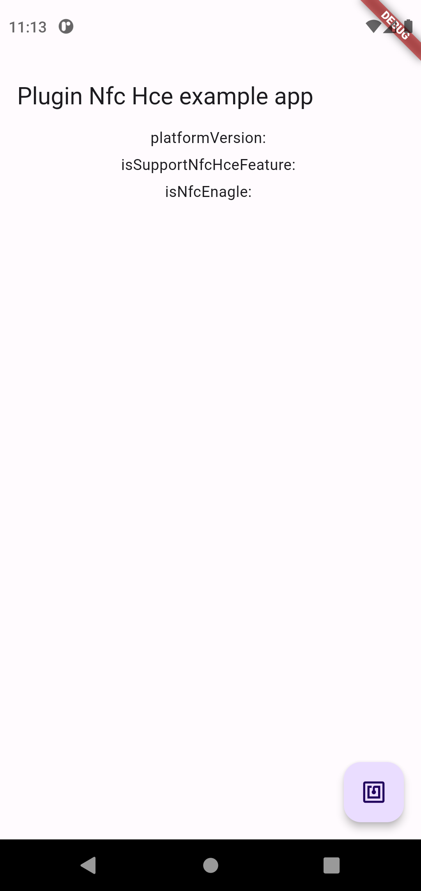
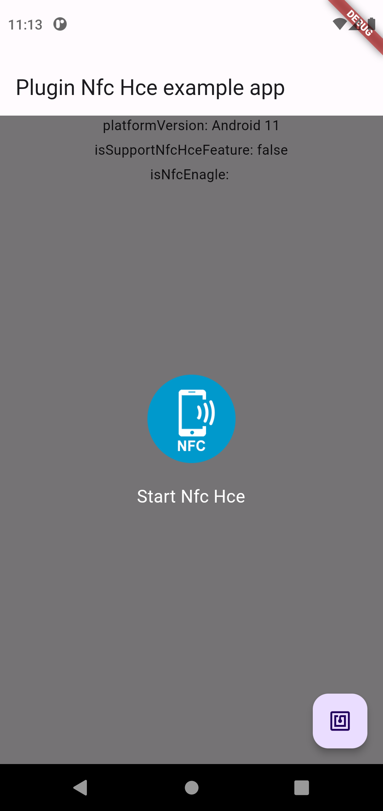

# flutter_nfc_hce

"flutter_nfc_hce plugin project"

## 1. Introduction

* This project was initiated during the process of exploring methods for exchanging data
between cross-platforms using NFC. 


* The flutter_nfc_hce plugin project was created to utilize the functionality in flutter, 
using Qifan Yang's NFCAndroid's com.qifan.nfcbank.cardEmulation.KHostApduService.
(reference: https://github.com/underwindfall/NFCAndroid) 


* Regarding the Android 13 version issues related to NFC HCE operation, 
modifications were made to the following section with reference to
[https://github.com/MichaelsPlayground/NfcHceNdefEmulator](https://github.com/MichaelsPlayground/NfcHceNdefEmulator)

    ````xml
    // KHostApduService.kt
    private val READ_CAPABILITY_CONTAINER_RESPONSE = byteArrayOf(
    0x00.toByte(), 0x0F.toByte(), // CCLEN length of the CC file
    0x20.toByte(), // Mapping Version 2.0
    0x00.toByte(), 0x3B.toByte(), // MLe maximum
    0x00.toByte(), 0x34.toByte(), // MLc maximum
    0x04.toByte(), // T field of the NDEF File Control TLV
    0x06.toByte(), // L field of the NDEF File Control TLV
    0xE1.toByte(), 0x04.toByte(), // File Identifier of NDEF file
    0x00.toByte(), 0xFF.toByte(), // Maximum NDEF file size of 65534 bytes
    0x00.toByte(), // Read access without any security
    0xFF.toByte(), // Write access without any security
    0x90.toByte(), 0x00.toByte(), // A_OKAY
    )
    ````


* The NFC HCE operation works from Android 11 to 13, and we would like to inform you that in the current initial project,
the supported AID is fixed to D2760000850101 for usage."


* For NFC HCE Reader, you can refer to the example created using flutter_manager at
[https://github.com/deokgyuhan/flutter_nfc_hce_reader](https://github.com/deokgyuhan/flutter_nfc_hce_reader)"

## 2. Screenshots


| Main                               | Android NFC HCE                                  |
|------------------------------------|--------------------------------------------------|
|  |  |

## 3. Setup
**Android Setup**

1) Add permission to your `AndroidManifest.xml`.
   ````xml
    <uses-permission android:name="android.permission.NFC" />
    <uses-feature android:name="android.hardware.nfc" android:required="true" />
    <uses-feature android:name="android.hardware.nfc.hce" android:required="true" />
    <uses-permission android:name="android.permission.VIBRATE" />
   ````

2) Register service to your `AndroidManifest.xml`.
   ````xml
    <service android:name="com.novice.flutter_nfc_hce.KHostApduService"
                 android:exported="true"
                 android:enabled="true"
                 android:permission="android.permission.BIND_NFC_SERVICE">
       <intent-filter>
           <action android:name="android.nfc.cardemulation.action.HOST_APDU_SERVICE"/>
           <category android:name="android.intent.category.DEFAULT"/>
       </intent-filter>
      <meta-data android:name="android.nfc.cardemulation.host_apdu_service"
                 android:resource="@xml/apduservice"/>
    </service>
   ````

3) Add apduservice.xml to your res/xml
    ````xml
    <?xml version="1.0" encoding="utf-8"?>
    <host-apdu-service xmlns:android="http://schemas.android.com/apk/res/android"
                       android:description="@string/servicedesc" android:requireDeviceScreenOn="false" android:requireDeviceUnlock="false">
        <aid-group android:description="@string/aiddescription"  android:category="other" >
            <aid-filter android:name="D2760000850101"/>
        </aid-group>
    </host-apdu-service>
    ````

4) Add strings.xml to your res/values
    ````xml
    <resources>
    <string name="servicedesc">servicedesc</string>
    <string name="aiddescription">aiddescription</string>
    </resources>
    ````  

## 4. Usage
```dart
import 'package:flutter_nfc_hce/flutter_nfc_hce.dart';

//plugin instance 
final _flutterNfcHcePlugin = FlutterNfcHce();

//getPlatformVersion
var platformVersion = await _flutterNfcHcePlugin.getPlatformVersion();

//isNfcHceSupported
bool? isNfcHceSupported = await _flutterNfcHcePlugin.isNfcHceSupported();

//isSecureNfcEnabled
bool? isSecureNfcEnabled = await _flutterNfcHcePlugin.isSecureNfcEnabled();

//isNfcEnabled 
bool? isNfcEnabled = await _flutterNfcHcePlugin.isNfcEnabled();

//nfc content
var content = 'flutter_nfc_hce';

//start nfc hce 
var result = await _flutterNfcHcePlugin.startNfcHce(content);

//stop nfc hce 
await _flutterNfcHcePlugin.stopNfcHce();
```

## 5. Update history

### 2023.09.17 Update
#### * Update Contributor:[BugsOverBugs](https://github.com/BugsOverBugs), [atanasyordanov21](https://github.com/atanasyordanov21)
1. Add the `persistMessage` option to the `startHce` function (with a default value of true).

```
 Future<String?> startNfcHce(
      String content, {
        String mimeType = 'text/plain',
        bool persistMessage = true,
      }) {
    return FlutterNfcHcePlatform.instance.startNfcHce(
      content,
      mimeType,
      persistMessage,
    );
  }
```
2. Delete the internal storage file when executing the `stopNfcHce` function.


3. Even if the `stopNfcHce` function is not executed and the app is closed, NFC HCE continues to operate.
   In this case, when you run `startNfcHce` after a device reboot, it reads the NDEF message from the internal storage file and initializes the message.


### 2023.09.16 Update
#### * Update Contributor:[BugsOverBugs](https://github.com/BugsOverBugs)

1. Refactor the source code and function names.


2. Add a default argument 'mimeType' to the 'startNfcHce()' function.


3. Add 'stopNfcHce' API.


4. Write the initial NFC HCE NDEF message to internal storage and, upon app restart, read and initialize it from the file.


### 2023.09.08 Update
1. Support operation in both foreground and background, 
   but specifically enable NFC card reader access even when the device screen is fully locked on Android 12 and higher.

  * When applying option 1, make sure to update the contents of 'Add apduservice.xml to your res/xml'. 
  
2. add isSupportSecureNfcSupported api
